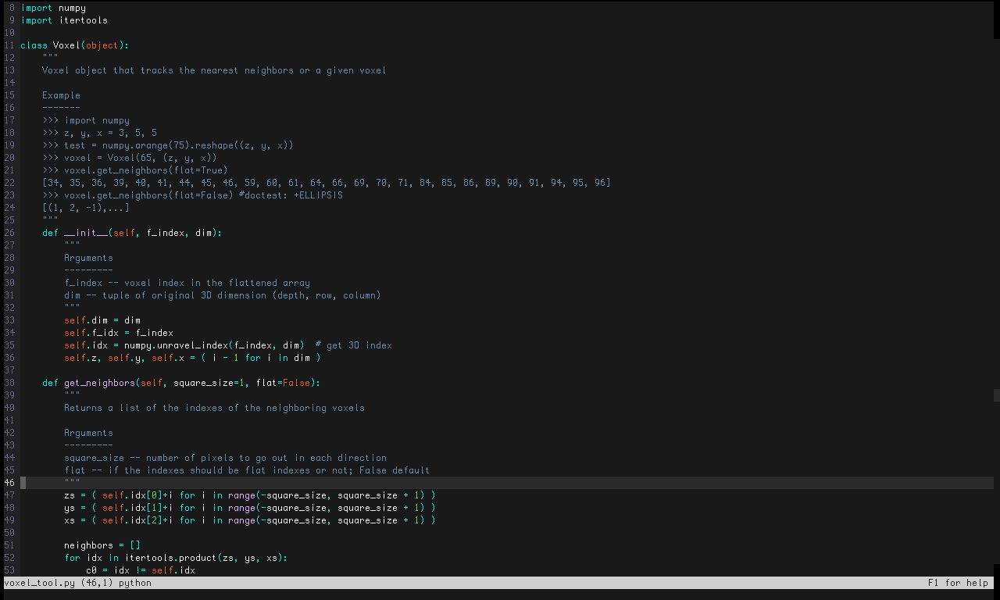

# Photon-Racer
Photon-Racer is based on the brackets original theme [Photon Racer](https://github.com/Brackets-Themes/PhotonRacer). 

Photon-Racer is a *dark* theme made with speed in mind



## Installation

From you micro editor, press `CtrlE` and type the command:

```
> plugin install photon-racer
```

After restarting the micro editor, update your colorscheme with

```
> set colorscheme photon-racer
```